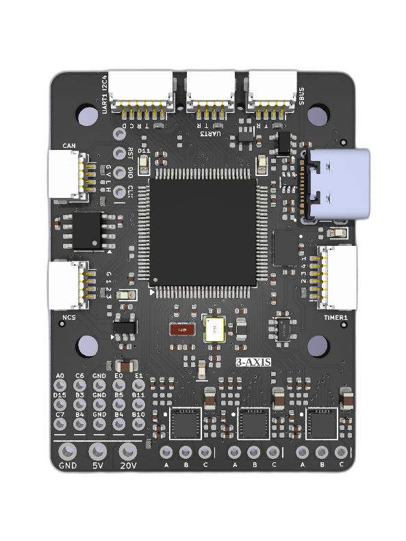
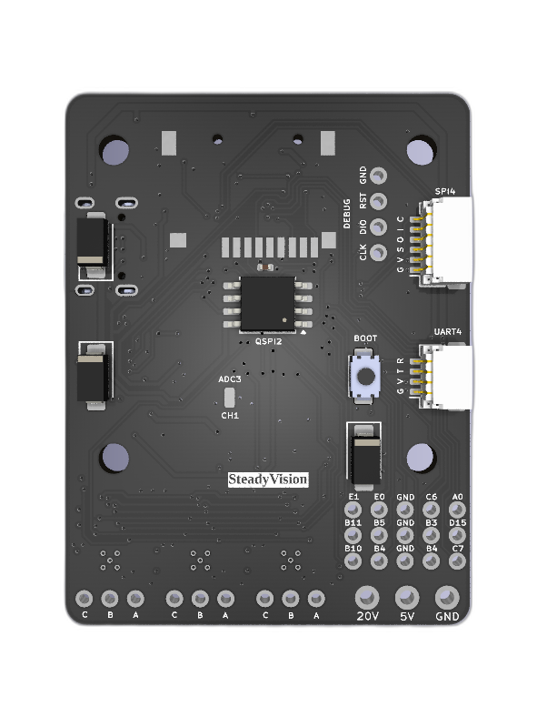

# FOC

This is an open source implementation of Field Oriented Control motor control. It is implemented based on the [PCB](https://github.com/FreeFa11/SteadyVision/tree/master/Hardware/PCB) of my [Gimbal](https://github.com/FreeFa11/SteadyVision/) project. The main FOC code can be easily ported with only slight modifications if needed.

<!-- This was made separate for my own experimentation and refinement of the code.  -->

## [PCB](./Hardware/PCB/)

    
    

### Hardware Used

- STM32H743 Microcontroller
- DRV8311 Motor Drivers
- MT6816 External Encoders

## License

All the files are licensed under [BSD 3-Clause](./LICENSE).